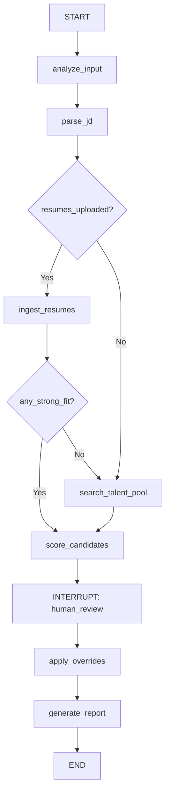

# HireLens AI — Agentic Architecture Upgrade

Transform the existing linear pipeline into a full agentic AI HR screening system with LangGraph orchestration, 5-dimension rubric scoring, LinkedIn ingestion, Human-in-the-Loop overrides, and audit logging.

## Current State Summary

The codebase is a **working linear pipeline** with these components:

| Module | File | What It Does |
|--------|------|-------------|
| Text Extraction | [text_extract.py](file:///c:/Users/pande/Sanchit/Personal/TCI/hirelens-ai/resume_model/text_extract.py) | PDF (PyMuPDF) + DOCX parsing → raw text + links |
| JD Parser | [jd_api_integration.py](file:///c:/Users/pande/Sanchit/Personal/TCI/hirelens-ai/resume_model/jd_api_integration.py) | Gemini LLM extracts structured JD JSON (skills, experience, education) |
| Resume Parser | [resume_api_integration.py](file:///c:/Users/pande/Sanchit/Personal/TCI/hirelens-ai/resume_model/resume_api_integration.py) | Gemini LLM extracts structured resume JSON (skills, education, work_experience, projects) |
| Hybrid Retrieval | [embedding_matching.py](file:///c:/Users/pande/Sanchit/Personal/TCI/hirelens-ai/resume_model/embedding_matching.py) | FAISS + BM25 + RRF fusion over a pre-built vector index (137 PDFs indexed) |
| LLM Scorer | [llm_fit_scorer.py](file:///c:/Users/pande/Sanchit/Personal/TCI/hirelens-ai/resume_model/llm_fit_scorer.py) | Generic 0–100 scoring with "Strong/Moderate/Not Fit" — **no rubric dimensions** |
| Index Builder | [build_index.py](file:///c:/Users/pande/Sanchit/Personal/TCI/hirelens-ai/build_index.py) | Offline batch indexing of PDF resumes into FAISS + BM25 |
| Streamlit UI | [streamlit_app.py](file:///c:/Users/pande/Sanchit/Personal/TCI/hirelens-ai/streamlit_app.py) | Upload JD (.txt) → vector search → LLM score → ranked cards. **No resume upload, no HIL** |
| FastAPI | [app.py](file:///c:/Users/pande/Sanchit/Personal/TCI/hirelens-ai/api/app.py) | REST API for the same pipeline |

**What's Missing** (gap analysis against requirements):

| Requirement | Status |
|-------------|--------|
| Agentic coordination (LangGraph) | ❌ Not present — fixed linear flow |
| Resume/DOCX upload by user | ❌ Only vector DB search |
| LinkedIn JSON ingestion | ❌ Not implemented |
| 5-Dimension Rubric (Skills 30%, Exp 25%, Edu 15%, Projects 20%, Communication 10%) | ❌ Generic single score |
| Per-dimension justifications | ❌ Only overall summary |
| Hire/No-Hire recommendation | ⚠️ Has "Strong Fit" / "Moderate Fit" / "Not Fit" — needs mapping to Hire/No-Hire |
| Strategic Talent Pool search (auto-trigger if no Strong Fit) | ❌ Not implemented |
| Human-in-the-Loop score override | ❌ Not implemented |
| Audit trail / JSON logging | ❌ Not implemented |
| PII masking before LLM calls | ⚠️ Resume parser strips PII from output, but raw text is sent to LLM |
| Prompt injection protection | ⚠️ Uses structured JSON schema output — good start, needs hardening |
| LangSmith observability | ❌ Not integrated |

---

## User Review Required

> [!IMPORTANT]
> **Agent Framework Choice**: The plan uses **LangGraph** (not CrewAI) for the agent orchestrator. LangGraph provides explicit state machine control with interrupt/resume for the HIL wait state, which maps perfectly to our requirements. CrewAI is better for multi-agent delegation patterns. Do you have a preference?

> [!IMPORTANT]
> **LLM Model**: The current codebase uses `gemini-3.1-flash-lite-preview` for all LLM calls. We will keep using the Google GenAI SDK for all LLM operations. Should we upgrade the scoring model to a higher-capability model (e.g., `gemini-2.5-flash`) for the rubric scoring step, or keep the current model?

> [!IMPORTANT]
> **LinkedIn Data Source**: The requirements mention LinkedIn JSON/scrape data. For the prototype, we will accept **manually exported LinkedIn JSON files** (no live scraping API). The user uploads a `.json` file conforming to a documented schema. Is this acceptable, or do you want RapidAPI LinkedIn Scraper integration?

## Open Questions

> [!NOTE]
> **Report Output Format**: The requirements mention PDF/HTML/JSON report output. For the initial prototype, should we prioritize one format (e.g., downloadable HTML with Jinja2), or implement all three?

> [!NOTE]
> **Streamlit vs FastAPI**: The Streamlit app is the primary UI. Should the FastAPI backend also be upgraded with the same agentic flow, or should we focus exclusively on the Streamlit app for now?

---

## Proposed Changes

The changes are organized into 7 components, ordered by dependency (foundations first, then features that build on them).

---

### Component 1: New Dependencies & Project Setup

#### [MODIFY] [requirements.txt](file:///c:/Users/pande/Sanchit/Personal/TCI/hirelens-ai/requirements.txt)

Add the following dependencies:

```diff
 fastapi
 uvicorn
 python-dotenv
 google-genai
 pymupdf
 python-docx
 numpy
 faiss-cpu
 rank_bm25
+langgraph
+langchain-core
+langchain-google-genai
+pydantic>=2.0
+jinja2
+streamlit
```

**Rationale**:
- `langgraph` + `langchain-core` + `langchain-google-genai`: Agent orchestration with state machine and Google Gemini integration
- `pydantic>=2.0`: Structured output validation (prompt injection protection)
- `jinja2`: HTML report generation
- `streamlit`: Making it an explicit dependency

---

### Component 2: LinkedIn JSON Ingestion

#### [NEW] [linkedin_parser.py](file:///c:/Users/pande/Sanchit/Personal/TCI/hirelens-ai/resume_model/linkedin_parser.py)

New module to parse LinkedIn profile data (JSON format) and normalize it into the same structured format used for PDF/DOCX resumes.

**Design**:
- Accept a JSON file/dict with LinkedIn profile fields (headline, summary, positions, education, skills, projects, certifications)
- Normalize into the **same output schema** as `resume_api_integration.py` → `{candidate_id, skills, education, work_experience, projects, achievements}`
- This ensures downstream scoring treats LinkedIn profiles identically to uploaded resumes
- Uses a Pydantic model for input validation to reject malformed JSON

**LinkedIn JSON Input Schema** (documented for users):
```json
{
  "full_name": "...",
  "headline": "...",
  "summary": "...",
  "positions": [{"title": "...", "company": "...", "duration": "...", "description": "..."}],
  "education": [{"degree": "...", "school": "...", "year": "..."}],
  "skills": ["Python", "AWS", ...],
  "certifications": [{"name": "...", "authority": "..."}],
  "projects": [{"title": "...", "description": "..."}]
}
```

#### [MODIFY] [text_extract.py](file:///c:/Users/pande/Sanchit/Personal/TCI/hirelens-ai/resume_model/text_extract.py)

Add `.txt` and `.json` file support to the `extract_text_and_links()` dispatcher function:
- `.txt` → read as plain text (for JD files)
- `.json` → delegate to LinkedIn parser
- Keeps the single entry-point pattern

---

### Component 3: 5-Dimension Rubric Scorer (Core Requirement)

This is the **biggest change** in the system. The current `llm_fit_scorer.py` produces a single 0–100 score. We need a complete rewrite of the scoring prompt and output schema.

#### [MODIFY] [llm_fit_scorer.py](file:///c:/Users/pande/Sanchit/Personal/TCI/hirelens-ai/resume_model/llm_fit_scorer.py)

**What changes**:
1. **New output schema** — Each candidate gets 5 dimension scores (0–10), per-dimension justification, weighted total, and Hire/No-Hire
2. **New prompt** — Enforces the exact rubric criteria from the requirements
3. **Pydantic models** for output validation (prompt injection protection)

**New Output Schema per Candidate**:
```json
{
  "candidate_id": "string",
  "dimensions": {
    "skills_match": {"score": 8, "weight": 0.30, "justification": "85%+ skills match including..."},
    "experience_relevance": {"score": 7, "weight": 0.25, "justification": "Adjacent domain with..."},
    "education_certs": {"score": 6, "weight": 0.15, "justification": "Meets minimum B.Tech..."},
    "project_portfolio": {"score": 9, "weight": 0.20, "justification": "Strong relevant portfolio..."},
    "communication_quality": {"score": 7, "weight": 0.10, "justification": "Crisp and structured..."}
  },
  "weighted_total": 7.55,
  "recommendation": "Hire",
  "summary": "2-sentence overall summary"
}
```

**Scoring Rubric Prompt** (enforced via structured output):

| Dimension | Weight | 0 (Poor) | 5 (Average) | 10 (Excellent) |
|-----------|--------|----------|-------------|----------------|
| Skills Match | 30% | <30% skills match | 50–70% skills match | >85% skills match |
| Experience Relevance | 25% | Unrelated domain | Adjacent domain | Exact domain & seniority |
| Education & Certs | 15% | Below minimum | Meets minimum | Exceeds + extra certs |
| Project / Portfolio | 20% | No evidence | 1–2 generic projects | Strong relevant portfolio |
| Communication Quality | 10% | Poor structure/grammar | Adequate clarity | Crisp, structured, impactful |

**Hire/No-Hire mapping**:
- `weighted_total >= 7.0` → **Hire** (Strong Fit)
- `weighted_total >= 5.0 && < 7.0` → **Maybe** (Moderate Fit)
- `weighted_total < 5.0` → **No Hire** (Not Fit)

---

### Component 4: LangGraph Agent Orchestration

This is the **architectural transformation** — replacing the linear pipeline with a stateful agent.

#### [NEW] [agent/state.py](file:///c:/Users/pande/Sanchit/Personal/TCI/hirelens-ai/agent/state.py)

Define the agent's shared state using a `TypedDict`:

```python
class AgentState(TypedDict):
    jd_text: str                      # Raw JD text
    jd_json: dict                     # Parsed JD requirements
    uploaded_resumes: list[dict]      # Resumes from user uploads (PDF/DOCX/LinkedIn)
    talent_pool_resumes: list[dict]   # Resumes from vector DB search
    all_candidates: list[dict]        # Merged candidate list
    scored_candidates: list[dict]     # After rubric scoring
    has_strong_fit: bool              # Controls talent pool trigger
    human_overrides: list[dict]       # HIL override log
    audit_log: list[dict]            # Full audit trail
    search_triggered: bool            # Whether talent pool was used
    error: str | None                 # Error state
```

#### [NEW] [agent/tools.py](file:///c:/Users/pande/Sanchit/Personal/TCI/hirelens-ai/agent/tools.py)

Wrap existing modules as LangGraph "tool nodes":

| Tool Name | Wraps | Purpose |
|-----------|-------|---------|
| `parse_jd` | `jd_api_integration.call_jd_gemini_api()` | Extract JD requirements |
| `parse_resume_file` | `text_extract` + `resume_api_integration` | PDF/DOCX → structured JSON |
| `parse_linkedin` | `linkedin_parser` (new) | LinkedIn JSON → structured JSON |
| `search_talent_pool` | `embedding_matching.HybridResumeRetriever.hybrid_search()` | FAISS + BM25 search |
| `score_candidates` | `llm_fit_scorer` (rewritten) | 5-dimension rubric scoring |

#### [NEW] [agent/graph.py](file:///c:/Users/pande/Sanchit/Personal/TCI/hirelens-ai/agent/graph.py)

The LangGraph state machine definition:



**Key agentic behaviors**:
1. **Step 4 — Strategic Search**: If user uploaded resumes but none score as "Strong Fit" (weighted_total ≥ 7.0), the agent **autonomously** triggers a talent pool search to find better matches
2. **Step 6 — HIL Wait State**: The graph uses LangGraph's `interrupt()` to pause execution. Streamlit displays results and collects overrides. The graph resumes with override data.

#### [NEW] [agent/__init__.py](file:///c:/Users/pande/Sanchit/Personal/TCI/hirelens-ai/agent/__init__.py)

Package init to expose `create_agent_graph()`.

---

### Component 5: Human-in-the-Loop & Audit Trail

#### [NEW] [agent/audit.py](file:///c:/Users/pande/Sanchit/Personal/TCI/hirelens-ai/agent/audit.py)

**Audit Logger** — stores all override events as structured JSON:

```json
{
  "audit_log": [
    {
      "timestamp": "2026-05-09T17:30:00+05:30",
      "candidate_id": "42.pdf",
      "action": "score_override",
      "dimension": "skills_match",
      "original_score": 6,
      "original_justification": "50-70% skills match...",
      "new_score": 8,
      "reason": "Candidate has unlisted AWS certification verified in interview",
      "overridden_by": "HR_user"
    }
  ]
}
```

**Storage**: JSON file at `audit_logs/audit_<timestamp>.json`. New file per session.

**Features**:
- `log_override()` — Records a single dimension override
- `log_flag()` — Records a candidate being flagged for review
- `export_log()` — Returns the full audit trail as JSON
- All entries include: original LLM score, original justification, new score, reason, timestamp, candidate_id

---

### Component 6: Streamlit UI Overhaul

#### [MODIFY] [streamlit_app.py](file:///c:/Users/pande/Sanchit/Personal/TCI/hirelens-ai/streamlit_app.py)

This is the largest UI change. The current app only does JD upload → vector search → display cards. We need to add:

**Input Section Changes**:
1. **Resume Upload Widget** — `st.file_uploader()` for PDF/DOCX files (multiple, `accept_multiple_files=True`)
2. **LinkedIn JSON Upload** — `st.file_uploader()` for `.json` files
3. **Keep existing JD upload** (already works for `.txt`)
4. **Toggle**: "Also search Talent Pool" checkbox (default: auto-trigger if no Strong Fit)

**Results Section Changes**:
1. **Rubric Breakdown per Candidate** — Replace the simple score display with a 5-bar visualization:
   - Each dimension shows: name, score (0–10), weight, bar chart, justification
   - Color-coded: green (8–10), yellow (5–7), red (0–4)
2. **Weighted Total** — Prominent display replacing the old 0–100 score
3. **Hire / Maybe / No Hire** pill replacing "Strong Fit / Moderate Fit / Not Fit"

**Human-in-the-Loop Section** (new):
1. **Override Panel** per candidate (inside an expander):
   - 5 sliders (one per dimension, 0–10) pre-filled with LLM scores
   - Text input for override reason
   - "Submit Override" button
2. **Flag Candidate** button — marks a candidate for further review
3. **Audit Log Viewer** — Expander at the bottom showing all overrides in current session
4. When overrides are submitted, the weighted total recalculates live

**Report Download**:
1. "Download Report" button → generates an HTML report via Jinja2
2. Report includes: all candidates, rubric scores, justifications, overrides (if any)

---

### Component 7: Security Mitigations

#### [MODIFY] [resume_api_integration.py](file:///c:/Users/pande/Sanchit/Personal/TCI/hirelens-ai/resume_model/resume_api_integration.py)

**PII Masking** — Add a `mask_pii()` function that strips/redacts PII from raw resume text **before** sending to the LLM:
- Regex patterns for email, phone numbers, URLs (except LinkedIn)
- Replace with `[EMAIL_REDACTED]`, `[PHONE_REDACTED]`, etc.
- The existing system instruction already tells the LLM to strip PII from output, but this adds defense-in-depth

#### [MODIFY] [jd_api_integration.py](file:///c:/Users/pande/Sanchit/Personal/TCI/hirelens-ai/resume_model/jd_api_integration.py)

**Prompt Injection Hardening**:
- Already uses structured JSON output schema (good!)
- Add input sanitization: strip any `<system>`, `<instruction>`, or prompt-injection patterns from JD text before sending to LLM
- Add max input length validation (prevent token-stuffing attacks)

#### [NEW] [security/pii_masker.py](file:///c:/Users/pande/Sanchit/Personal/TCI/hirelens-ai/security/pii_masker.py)

Centralized PII masking utility:
- `mask_pii(text: str) -> str` — redact emails, phones, addresses
- `sanitize_input(text: str) -> str` — strip prompt injection patterns
- Used by both resume and JD parsers

#### [MODIFY] [.gitignore](file:///c:/Users/pande/Sanchit/Personal/TCI/hirelens-ai/.gitignore)

Add:
```diff
+audit_logs/
+index_store/
+resume_data/
```

Ensure `.env` is already there (confirmed ✓) and `index_store/` + `resume_data/` aren't committed (they contain user data).

---

## New Directory Structure

After all changes, the project structure will be:

```
hirelens-ai/
├── agent/                          # NEW — LangGraph agent
│   ├── __init__.py
│   ├── state.py                    # AgentState TypedDict
│   ├── tools.py                    # Tool wrappers for existing modules
│   ├── graph.py                    # LangGraph state machine definition
│   └── audit.py                    # Audit trail logger
├── resume_model/                   # EXISTING — enhanced
│   ├── text_extract.py             # MODIFIED — add .txt/.json support
│   ├── jd_api_integration.py       # MODIFIED — input sanitization
│   ├── resume_api_integration.py   # MODIFIED — PII masking
│   ├── embedding_matching.py       # UNCHANGED — hybrid retrieval works great
│   ├── llm_fit_scorer.py           # REWRITTEN — 5-dimension rubric scoring
│   └── linkedin_parser.py          # NEW — LinkedIn JSON → structured profile
├── security/                       # NEW
│   └── pii_masker.py               # Centralized PII masking + input sanitization
├── templates/                      # NEW
│   └── report.html                 # Jinja2 HTML report template
├── audit_logs/                     # NEW — generated at runtime
├── api/
│   └── app.py                      # MODIFIED — upgrade to use agent
├── streamlit_app.py                # MAJOR REWRITE — full agentic UI + HIL
├── build_index.py                  # UNCHANGED
├── requirements.txt                # MODIFIED — new deps
├── .env                            # UNCHANGED (already in .gitignore)
└── .gitignore                      # MODIFIED
```

---

## Verification Plan

### Automated Tests

1. **Unit tests for each tool**:
   - `test_linkedin_parser.py` — Validate LinkedIn JSON → normalized schema
   - `test_rubric_scorer.py` — Verify 5-dimension output schema, weighted total calculation
   - `test_pii_masker.py` — Confirm emails, phones, URLs are redacted
   - `test_audit.py` — Override logging produces valid JSON

2. **Integration test**:
   - Full agent flow: Upload JD (.txt) + 2 sample resumes (PDF) + 1 LinkedIn JSON → verify ranked output with all 5 dimensions

3. **Streamlit smoke test via browser**:
   - Launch `streamlit run streamlit_app.py`
   - Upload JD + resume files
   - Verify rubric cards render with 5 dimensions
   - Test override flow: adjust a score, verify audit log updates
   - Test report download

### Manual Verification

- Verify the agent triggers talent pool search when no uploaded resumes yield "Strong Fit"
- Verify HIL override recalculates weighted total
- Verify audit log JSON is well-formed and contains all required fields
- Inspect PII masking on sample resumes with known email/phone data
